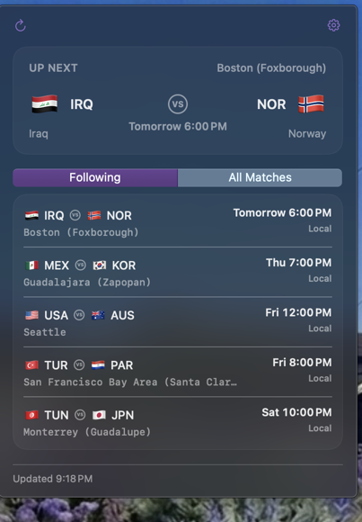
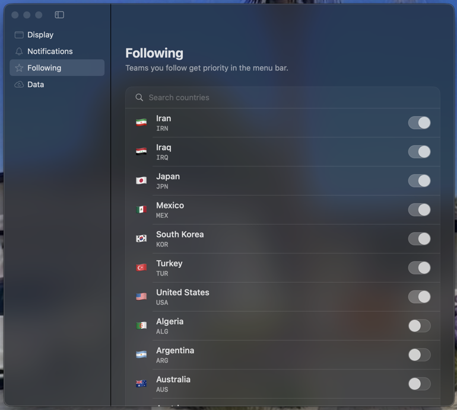

# World Cup Bar

<div align="center">

  **Live 2026 FIFA World Cup scores in your Mac's menu bar**

  
  
  
  
  
  

  ### [⬇ Download for macOS](https://github.com/thedandano/world-cup-kickoff-bar/releases/latest/download/WorldCupBar.dmg)

  <a href="https://www.buymeacoffee.com/CagXd3ZFyZ"></a>

  Live scores · Upcoming fixtures · Kickoff alerts all from your menu bar. No browser required.

</div>

---



## What is it?

World Cup Bar lives quietly in your Mac's menu bar and keeps you up to date on every match of the 2026 FIFA World Cup. Glance up to see the current score; click for upcoming fixtures and a countdown to the next kickoff. It nudges you with a notification before your team plays, so you never miss the whistle while you're heads-down working.

No browser tab. No Dock clutter. Just a tiny status that's always there when you want it and ignorable when you don't.

## Why you'll like it

- ⚽ **Score at a glance** — the live result sits right in your menu bar
- ⭐ **Follow your teams** — the matches you care about jump to the front
- 📅 **What's next** — upcoming fixtures with venue and your local kickoff time (Today / Tomorrow / weekday)
- 🔔 **Kickoff alerts** — a heads-up 5, 15, 30, or 60 minutes before — or off entirely
- 🪶 **Light and native** — built with Swift, sips battery, no Electron
- ✈️ **Works offline** — the last scores you saw are cached and shown instantly on launch
- 🔒 **Private** — your followed teams and settings never leave your Mac

---

## Install

**Requires macOS 14 (Sonoma) or later.**

1. **[⬇ Download the latest release](https://github.com/thedandano/world-cup-kickoff-bar/releases/latest/download/WorldCupBar.dmg)** (or browse [all releases](https://github.com/thedandano/world-cup-kickoff-bar/releases) for older versions and release notes).
2. Open the DMG and **drag World Cup Bar onto the Applications shortcut**.
3. Launch it. A status appears in your menu bar. Click it for scores and fixtures.

The app is signed and **notarized by Apple**, so it opens with no scary warnings, and it **updates itself** automatically when new versions ship.

### Launch it automatically when your Mac starts

1. **System Settings → General → Login Items**
2. Under **"Open at Login"**, click **+**
3. Pick **World Cup Bar**

Done! It'll start with your Mac from now on.

---

## Make it yours

Click the status and open **Settings** to:

- **Follow teams** — pick who gets priority in the menu bar and dropdown
- **Menu bar style** — show team codes (USA) or flag emoji (🇺🇸)
- **Kickoff alerts** — choose your lead time, or turn them off



---

## Privacy

No personal data is collected, and there are **no analytics or third-party tracking SDKs**. Nothing leaves your device. Your followed teams, preferences, and cached scores are stored locally. Match data comes from <a href=https://worldcup26.ir target="_blank" rel="noopener noreferrer"> worldcup26.ir </a>.

---

## For developers

The app is an Xcode project generated from `project.yml` with [XcodeGen](https://github.com/yonaskolb/XcodeGen) (Xcode 16+):

```bash
brew install xcodegen
xcodegen generate                                                  # creates WorldCupBar.xcodeproj
open WorldCupBar.xcodeproj                                          # Build & Run with ⌘R
xcodebuild -scheme WorldCupBar -destination 'platform=macOS' test  # full test suite
swift test                                                         # fast: Core logic only
swiftlint lint --strict                                            # lint
```

Strict MVVM with a `WorldCupBarCore` (pure logic) / `WorldCupBar` (SwiftUI) split. Architecture and conventions live in [`CLAUDE.md`](CLAUDE.md); release steps in [`RELEASING.md`](RELEASING.md). Contributions welcome — see [`CONTRIBUTING.md`](CONTRIBUTING.md).

---

## License

MIT. See [LICENSE](LICENSE).

**No warranty.** This software is provided as-is; the authors aren't responsible for any issues arising from its use.

---

<div align="center">
  <sub>Built for the 2026 FIFA World Cup · Data from worldcup26.ir · Unaffiliated with FIFA</sub>
</div>
